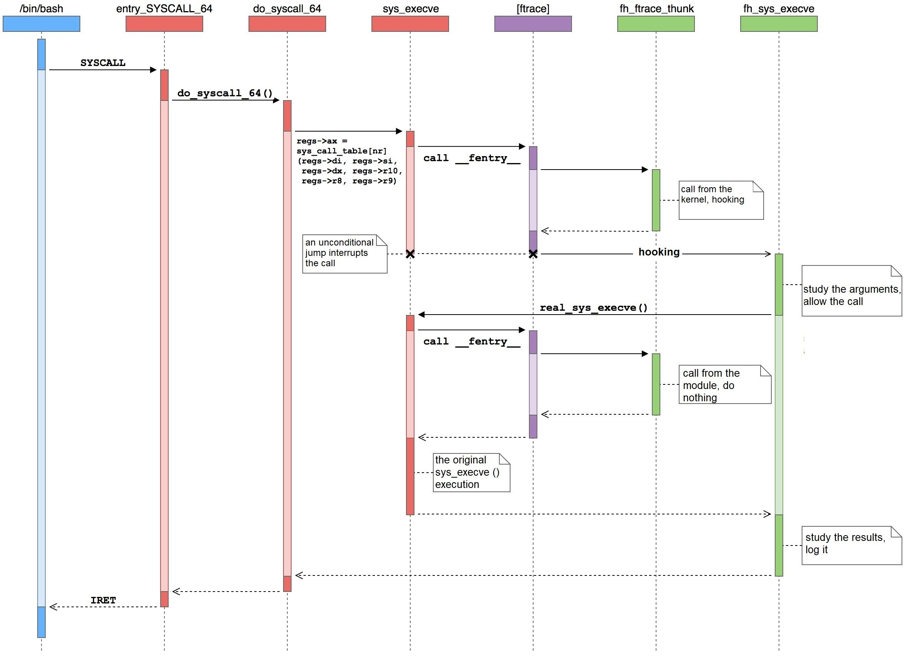

# Linux Syscall Hooking

518030910031陳韋廷

## Before we start

`sys_clone` prototype (defined in `include/linux/syscalls.h`)

```c
asmlinkage long sys_clone(unsigned long, unsigned long, int __user *, int __user *, unsigned long);
```

## Method 1: Modify `sys_call_table`

> `Ubuntu 20.04.2 LTS (GNU/Linux 5.4.0-74-generic x86_64)` is used in this section.

`sys_call_table` can be thought as an array of function pointers, which each entry represents a system call. In order to change the behavior of a specific syscall (or hooking), one has to

1. Locate `sys_call_table` in memory
2. Find the corresponding entry
3. Change where the entry is pointing to (and optionally save the original one somewhere else)

### Look for the table

In very early version of kernel (as early as 2.4), `sys_call_table` itself was exported, so accessing it was very easy. Starting from version 2.6 the symbol is no longer exported, but syscalls themselves (e.g. `sys_close`) were exported. Therefore the way to find the table became a full scan across the memory (in fact, somewhere between `sys_close` and `loops_per_jiffy`) and do some simple comparision.

```c
for (ptr = (unsigned long)sys_close; ptr < (unsigned long)&loops_per_jiffy; ptr += sizeof(void *)) {
  p = (unsigned long *)ptr;
  if (p[__NR_close] == (unsigned long)sys_close) {
    printk(KERN_DEBUG "[HOOK] Found the sys_call_table!!!\n");
    return (unsigned long **)p;
  }
}
```

*Reference: [https://github.com/0xabe-io/syscall-hooks/blob/master/hook_module.c](https://github.com/0xabe-io/syscall-hooks/blob/master/hook_module.c)*

The method worked until syscalls were also no longer exported (somewhere around 4.15).

For newer kernel, the `kallsyms_lookup_name` method is available. When compiling the kernel, a symbol table file `System.map` is generated. It is a look-up table between symbol names (variable or function) and their addresses in memory used by kernel. There's also a procfs file `/proc/kallsyms` that contains the look-up table of current boot (kernel address space layout randomization is enabled by default unless booted with parameter `nokaslr`). Therefore one can either

- Use the static address stated in `/boot/System.map-$(uname -r)`
- Use the address stated in `/proc/kallsyms`
- Use `kallsyms_lookup_name()`

to find `sys_call_table`.

In this report I'll introduce the `kallsyms_lookup_table` method.

`kallsyms_lookup_table()` is defined in `include/linux/kallsyms.h`, implemented in `kernel/kallsyms.c`.

```c
/* Lookup the address for this symbol. Returns 0 if not found. */
unsigned long kallsyms_lookup_name(const char *name)
{
	char namebuf[KSYM_NAME_LEN];
	unsigned long i;
	unsigned int off;

	for (i = 0, off = 0; i < kallsyms_num_syms; i++) {
		off = kallsyms_expand_symbol(off, namebuf, ARRAY_SIZE(namebuf));

		if (strcmp(namebuf, name) == 0)
			return kallsyms_sym_address(i);
	}
	return module_kallsyms_lookup_name(name);
}
EXPORT_SYMBOL_GPL(kallsyms_lookup_name);
```

The usage is as simple as `kallsyms_lookup_name("sys_call_table")`.

### Modify the table

The table is found, but it can't be modified directly because it sits in read-only data section.

```
root@nick:~# grep sys_call_table /proc/kallsyms 
ffffffffbd400280 R x32_sys_call_table
ffffffffbd4013a0 R sys_call_table
ffffffffbd4023e0 R ia32_sys_call_table
```

This is protected by the 16th bit of the `CR0` control register, which `When set, the CPU can't write to read-only pages when privilege level is 0`. Linux kernel exposes methods for reading and modifying control registers, namely `read_cr0` and `write_cr0`.

So disabling write protection would be something like

```c
unsigned long cr0 = read_cr0();
clear_bit(16, &cr0);
write_cr0(cr0);
```

Nonetheless, since kernel 5.x, WP-bit modification check is implemented. But loadable kernel modules are executing in ring 0 anyway, so just implement our own `write_cr0`.

```c
/* The original implementation in arch/x86/kernel/cpu/common.c */
void native_write_cr0(unsigned long val)
{
	unsigned long bits_missing = 0;

set_register:
	asm volatile("mov %0,%%cr0": "+r" (val) : : "memory");

	if (static_branch_likely(&cr_pinning)) {
		if (unlikely((val & X86_CR0_WP) != X86_CR0_WP)) {
			bits_missing = X86_CR0_WP;
			val |= bits_missing;
			goto set_register;
		}
		/* Warn after we've set the missing bits. */
		WARN_ONCE(bits_missing, "CR0 WP bit went missing!?\n");
	}
}
EXPORT_SYMBOL(native_write_cr0);

/* The implementation by ourselves */
inline void my_write_cr0(unsigned long cr0) {
  asm volatile("mov %0,%%cr0" : "+r"(cr0) : : "memory");
}
```

Finally the init function of this module will be

```c
static int __init my_init(void) {
  __sys_call_table = kallsyms_lookup_name("sys_call_table");
  if (!__sys_call_table) {
    pr_err("[hook] sys_call_table not found! exiting...\n");
    return -1;
  }
  pr_info("[hook] sys_call_table found at 0x%lx\n", __sys_call_table);

  pr_info("[hook] changing syscalls\n");
  disable_wp();
  orig_clone = (orig_clone_t)__sys_call_table[__NR_clone];
  __sys_call_table[__NR_clone] = (unsigned long) my_sys_clone;
  pr_info("[hook] sys_clone changed from 0x%lx to 0x%lx\n", (unsigned long)orig_clone, __sys_call_table[__NR_clone]);
  enable_wp();
  pr_info("[hook] successfully hooked\n");

  return 0;
}
```

The result output is

```
[ 8449.096308] [hook] sys_call_table found at 0xffffffffbd4013a0
[ 8449.096309] [hook] changing syscalls
[ 8449.096310] [hook] disable write protection
[ 8449.096324] [hook] sys_clone changed from 0xffffffffbc498bb0 to 0xffffffffc094c004
[ 8449.096324] [hook] enable write protection
[ 8449.096328] [hook] successfully hooked
[ 8489.232525] [hook.clone] sys_clone is hooked, caller: bash <- for test.o
[ 8521.658772] [hook.clone] sys_clone is hooked, caller: bash <- for bench.o
[ 8521.668507] [hook.clone] sys_clone is hooked, caller: bench
[ 8522.668788] [hook.clone] sys_clone is hooked, caller: bench
[ 8523.669083] [hook.clone] sys_clone is hooked, caller: bench
[ 8524.669358] [hook.clone] sys_clone is hooked, caller: bench
[ 8525.669675] [hook.clone] sys_clone is hooked, caller: bench
[ 8560.405223] [hook.clone] sys_clone is hooked, caller: bash <- for dmesg
[ 8625.826221] [hook] restoring syscalls...
[ 8625.826223] [hook] disable write protection
[ 8625.826236] [hook] enable write protection
[ 8625.826239] [hook] unloaded
```

## Method 2: `ftrace` with `kprobe`

> `Ubuntu 20.04.2 LTS (GNU/Linux 5.8.0-55-generic x86_64)` is used in this section.

### Introduction to `ftrace`

According to [kernel docs](https://www.kernel.org/doc/html/v5.12/trace/ftrace.html), `Ftrace is an internal tracer designed to help out developers and designers of systems to find what is going on inside the kernel. It can be used for debugging or analyzing latencies and performance issues that take place outside of user-space.`

It's usually used as an event tracer by attaching callbacks to the beginning of functions in order to record and trace the flow of the kernel. The prototype of the callback function is

```c
struct ftrace_ops {
	ftrace_func_t			func;    // callback function
	unsigned long			flags;   // ftrace flags
	void*							private; // any private data
};

void callback_func(unsigned long ip, unsigned long parent_ip, struct ftrace_ops *op, struct pt_regs *regs);
```

where

- `ip`: the instruction pointer of the traced function
- `parent_ip`: the instruction pointer of the function that called the traced function (the caller of the traced function)
- `op`: pointer to `struct ftrace_ops` that registered the callback
- `regs`: if `FTRACE_OPS_FL_SAVE_REGS` or `FTRACE_OPS_FL_SAVE_REGS_IF_SUPPORTED` is set, this will point to a `struct pt_regs` for CPU register access

To filter which functions to trace, use `ftrace_set_filter(struct ftrace_ops*, unsigned char* buf, int, int)` to add by name or `ftrace_set_filter_ip(struct ftrace_ops*, unsigned long, int, int)` to add by instruction pointer (aka function address).

Finally, use `register_ftrace_function()` to let `ftrace` call the callback. Use `unregister_ftrace_function()` to disable the callback.

### New way to find the original function: `kprobe`

Starting from kernel version 5.7, [`kallsyms_lookup_name` is unexported](https://lwn.net/Articles/813350/), so the previous mentioned method no longer works.

Kernel probe (`kprobe`) enables one to dynamically break into any kernel routine and collect debugging and performance information **non-disruptively**. Almost any kernel code address can be trapped.

Using `kprobe` is easy, `register_kprobe()` to attach one, and `unregister_kprobe()` to detach one. The important members of `struct kprobe` are

```c
struct kprobe {
  int* addr;
  const char* symbol_name;
};
```

So even if `kallsyms_lookup_name` is not exported anymore, one can still get the address of it using `kprobe` and use that. Finally, the `resolve_hook_address()` is implemented as

```c
static struct kprobe kp = {
  .symbol_name = "kallsyms_lookup_name"
};

static int resolve_hook_address(ftrace_hook_t* hook) {
  typedef unsigned long (*kallsyms_lookup_name_t)(const char* name);
  kallsyms_lookup_name_t kallsyms_lookup_name;
  register_kprobe(&kp);
  kallsyms_lookup_name = (kallsyms_lookup_name_t) kp.addr;
  unregister_kprobe(&kp);

  hook->address = kallsyms_lookup_name(hook->name);
  if (!hook->address) {
    pr_err("[hook] unresolved symbol: %s\n", hook->name);
    return -1;
  }

  pr_info("[hook] symbol %s found\n", hook->name);
  *((unsigned long*) hook->original) = hook->address;
  return 0;
}
```

### Function hooking with `ftrace`

`ftrace` is able to alter the register state after exiting the callback, so by changing the register `rip`, one can change the function executed by the processor.

The callback function looks like

```c
typedef struct ftrace_hook {
  const char* name;
  void* function;
  void* original;

  unsigned long address;
  struct ftrace_ops ops;
} ftrace_hook_t;

static void notrace ftrace_thunk(unsigned long ip, unsigned long parent_ip, struct ftrace_ops* ops, struct pt_regs* regs) {
  ftrace_hook_t* hook = container_of(ops, ftrace_hook_t, ops);
  if (!within_module(parent_ip, THIS_MODULE)) regs->ip = (unsigned long) hook->function; // recursion prevention
}
```

First get the address of the corresponding `ftrace_hook_t` that stores `ops`. Next change `rip` to the hook. The `if` statement is to prevent recursive calls. When the wrapper calls the original function, the original function will be traced by `ftrace` again. During the first call, `parent_ip` points to somewhere within the kernel, while during the repeated call it will only point inside our wrapper. Only during the first call should the control be passed. All other calls must let the original function be executed. The flow is as following



To sum up, the whole hook installing and removing procedure would look like

```c
int install_hook(ftrace_hook_t* hook) {
  int err;
  err = resolve_hook_address(hook);
  if (err) return err;

  hook->ops.func = ftrace_thunk;
  hook->ops.flags = FTRACE_OPS_FL_SAVE_REGS | FTRACE_OPS_FL_IPMODIFY;
  err = ftrace_set_filter_ip(&hook->ops, hook->address, 0, 0);
  if (err) {
    pr_err("[hook] ftrace_set_filter_ip() failed: %d\n", err);
    return err;
  }

  err = register_ftrace_function(&hook->ops);
  if (err) {
    pr_err("[hook] register_ftrace_function() failed: %d\n", err);
    return err;
  }

  return 0;
}

void remove_hook(ftrace_hook_t* hook) {
  int err;
  err = unregister_ftrace_function(&hook->ops);
  if (err) pr_err("[hook] unregister_ftrace_function() failed: %d\n", err);

  err = ftrace_set_filter_ip(&hook->ops, hook->address, 1, 0);
  if (err) pr_err("[hook] ftrace_set_filter_ip() failed: %d\n", err);
}
```

The result output is

```
[11709.118951] [hook] kallsyms_lookup_name is found at 0xffffffffa8d511f0
[11709.120314] [hook] symbol __x64_sys_clone found
[11709.124644] [hook] hooked
[11715.974908] [hook.clone] sys_clone is hooked, caller: bash <- dmesg
[11719.489568] [hook.clone] sys_clone is hooked, caller: bash <- test.o
[11862.833240] [hook.clone] sys_clone is hooked, caller: bash <- bench.o
[11862.843114] [hook.clone] sys_clone is hooked, caller: bench
[11863.844375] [hook.clone] sys_clone is hooked, caller: bench
[11864.844869] [hook.clone] sys_clone is hooked, caller: bench
[11865.845331] [hook.clone] sys_clone is hooked, caller: bench
[11866.845682] [hook.clone] sys_clone is hooked, caller: bench
```

## Reference

- [xcellerator / linux_kernel_hacking](https://github.com/xcellerator/linux_kernel_hacking)
- [ftrace - Function Tracer](https://www.kernel.org/doc/html/v5.12/trace/ftrace.html)
- [Using ftrace to hook to functions](https://www.kernel.org/doc/html/v5.12/trace/ftrace-uses.html)
- [Kernel Probes (Kprobes)](https://www.kernel.org/doc/html/v5.12/trace/kprobes.html)
- [Hooking Linux Kernel Functions, Part 2: How to Hook Functions with Ftrace](https://www.apriorit.com/dev-blog/546-hooking-linux-functions-2)