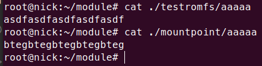

# Linux Kernel Lab 4 Report
518030910031陳韋廷

## Setup
Create 3 `static char*` global variables as the placeholder of 3 parameters.
```c
static char* hide = "hide";
static char* enc  = "enc";
static char* exec = "exec";
module_param(hide, charp, 0644);
module_param(enc, charp, 0644);
module_param(exec, charp, 0644);
```

## Hide

How to iterate through all files is defined in `romfs_readdir()`, the main iteration routine is implemented as
```c
for (;;) {
	if (!offset || offset >= maxoff) {
		offset = maxoff;
		ctx->pos = offset;
		goto out;
	}
	ctx->pos = offset;
  
	/* Fetch inode info */
	ret = romfs_dev_read(i->i_sb, offset, &ri, ROMFH_SIZE);
	if (ret < 0) goto out;
  
	j = romfs_dev_strnlen(i->i_sb, offset + ROMFH_SIZE, sizeof(fsname) - 1);
	if (j < 0) goto out;
  
	ret = romfs_dev_read(i->i_sb, offset + ROMFH_SIZE, fsname, j);
	if (ret < 0) goto out;
	fsname[j] = '\0';
  
	ino = offset;
	nextfh = be32_to_cpu(ri.next);
	if ((nextfh & ROMFH_TYPE) == ROMFH_HRD) ino = be32_to_cpu(ri.spec);
	if (!dir_emit(ctx, fsname, j, ino, romfs_dtype_table[nextfh & ROMFH_TYPE])) goto out;
  
	offset = nextfh & ROMFH_MASK;
}
```

The current processing file is obtained at the second `romfs_dev_read()` where `fsname` stores the name. The filename is then emitted to userspace by `dir_emit()`.

The idea is to compare current `fsname` with `hide`, and skip to the next entry before `dir_emit()` is called if matched. A simple `strncmp()`will work.

The following code segment is added after `fsname[j] = '\0';` and before `ino = offset;`

```c
pr_info("[readdir] fsname = %s\n", fsname);
if (!strncmp(fsname, hide, strlen(hide))) { // target found
	pr_info("[readdir] hide target %s found\n", hide);
	ino = offset;
	nextfh = be32_to_cpu(ri.next);
	if ((nextfh & ROMFH_TYPE) == ROMFH_HRD) ino = be32_to_cpu(ri.spec);
	offset = nextfh & ROMFH_MASK;
	continue;
}
```

## Encrypt

How a file is read is implemented in `romfs_readpage()`

```c
static int romfs_readpage(struct file *file, struct page *page)
{
	struct inode *inode = page->mapping->host;
	loff_t offset, size;
	unsigned long fillsize, pos;
	void *buf;
	int ret;

	buf = kmap(page);
	if (!buf)
		return -ENOMEM;

	/* 32 bit warning -- but not for us :) */
	offset = page_offset(page);
	size = i_size_read(inode);

	fillsize = 0;
	ret = 0;
	if (offset < size) {
		size -= offset;
		fillsize = size > PAGE_SIZE ? PAGE_SIZE : size;

		pos = ROMFS_I(inode)->i_dataoffset + offset;

		ret = romfs_dev_read(inode->i_sb, pos, buf, fillsize);
		if (ret < 0) {
			SetPageError(page);
			fillsize = 0;
			ret = -EIO;
		}
	}

	if (fillsize < PAGE_SIZE)
		memset(buf + fillsize, 0, PAGE_SIZE - fillsize);
	if (ret == 0)
		SetPageUptodate(page);

	flush_dcache_page(page);
	kunmap(page);
	unlock_page(page);
	return ret;
}
```

`buf` is a pointer to the mapped high memory page `page` returned by `kmap()`. The corresponding content of the file represented by `file` is then written into the page. After that, fill the page for padding and release related resource.

The idea is to find the file and modify it. File name is stored in `file->f_path.dentry->d_name.name`.

```c
// <linux/fs.h>
struct file {
	union {
		struct llist_node	fu_llist;
		struct rcu_head 	fu_rcuhead;
	} f_u;
	struct path		f_path;
	/* ... */
};

// <linux/path.h>
struct path {
	struct vfsmount *mnt;
	struct dentry *dentry;
};

// <linux/dcache.h>
struct dentry {
	/* RCU lookup touched fields */
	unsigned int d_flags;		/* protected by d_lock */
	seqcount_spinlock_t d_seq;	/* per dentry seqlock */
	struct hlist_bl_node d_hash;	/* lookup hash list */
	struct dentry *d_parent;	/* parent directory */
	struct qstr d_name;
	struct inode *d_inode;		/* Where the name belongs to - NULL is negative */
	unsigned char d_iname[DNAME_INLINE_LEN];	/* small names */
  /* ... */
};

struct qstr {
	union {
		struct {
			HASH_LEN_DECLARE;
		};
		u64 hash_len;
	};
	const unsigned char *name;
};
```

> Note: `d_iname` is the small name and considered not as robust as `d_name.name`

The following code segment is added after the `if (offset < size)` block and before the page-filling block.

```c
pr_info("[readpage] after read: offset = %lli, size = %lli\n", offset, size);
if (!strncmp(enc, file->f_path.dentry->d_name.name, cmp_size)) {
	pr_info("[readpage] enc target %s found\n", enc);
	dummy = buf;
	for (size_index = 0; size_index < size-1; size_index += 1) dummy[size_index] += 1;
}
```

`cmp_size` is the length of the shorter one between `enc` and file name. `dummy` is a `char*` used for manipulation. (directly manipulating `void*` is prohibited)

## Permission Change

When `ls`ing a directory, `romfs_lookup()` is also triggered in addition to `romfs_readdir()` mentioned earlier. The main iteration routine is

```c
for (;;) {
	if (!offset || offset >= maxoff) break;

	ret = romfs_dev_read(dir->i_sb, offset, &ri, sizeof(ri));
	if (ret < 0) goto error;

	/* try to match the first 16 bytes of name */
	ret = romfs_dev_strcmp(dir->i_sb, offset + ROMFH_SIZE, name, len);
	if (ret < 0) goto error;
	if (ret == 1) {
		/* Hard link handling */
		if ((be32_to_cpu(ri.next) & ROMFH_TYPE) == ROMFH_HRD) offset = be32_to_cpu(ri.spec) & ROMFH_MASK;
		inode = romfs_iget(dir->i_sb, offset);
		break;
	}

	/* next entry */
	offset = be32_to_cpu(ri.next) & ROMFH_MASK;
}
```

`romfs_dev_strcmp()` returns 1 if matched, 0 if not matched, <0 if error. `inode` points to the corresponding `inode` if found.

The idea is to change the `i_mode` member of `struct inode`. The least 3 bytes are the commonly seen permission.  (644, 755, etc.)

The following code segment is added after the iteration.

```c
if (inode) {
		pr_info("[lookup] name = %s, mode = 0%o\n", name, inode->i_mode);
		if (!strncmp(name, exec, strlen(name) < strlen(exec) ? strlen(name) : strlen(exec))) {
			pr_info("[lookup] exec target %s found\n", exec);
			inode->i_mode = inode->i_mode | 0755;
		}
}
```

## Result Screenshots

### Hide and Permission Change


### Encrypt



## Makefile Usage
- module related
	- `make`, `make all`: make the module
	- `make insert`: insert the module with 3 parameters: `hide`, `enc`, `exec``
	- `make remove`: remove the module from kernel
	- `make mount`: 
- romfs related
	- `make genrom`: generate `test.img`
	- `make mount`: mount `test.img`
	- `make umount`: unmount `test.img`